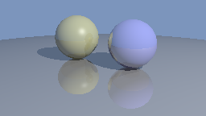

# Assignment 4: Ray Tracing

In this assignment we'll explore ray tracing, a rendering algorithm that is used in many high-end applications like film production and realistic computer games.  The central operation in this algorithm is tracing a ray through the scene, and the computation proceeds by computing the values of pixels one by one.  This is by contrast to the rasterization approach used in most real-time graphics systems, which is organized about drawing triangles to the screen one by one.

Ray tracing is in many ways the simplest rendering method, and you'll see that you can get an image computed with a minimum of code.  It's also very flexible and makes it simple to compute many advanced effects (this explains its use in applications where realism is important).  Getting good performance out of ray tracing is tricky, but with the right implementation running on the right hardware, one can trace billions of rays per second, and ray tracing is currently being rapidly adopted for real time applications.

This assignment focuses on building a simple toy ray tracer that can make nice renderings but is never going to be fast; we'll worry about big-O efficiency but not the constant factors.  To this end we'll use Python, with NumPy for the linear algebra, because it's a familiar and expressive language that will let us get a ray tracer working with just a few hundred lines of code.  We'll also follow the rule of making nearly all implementation decisions in favor of simple, direct code over constant-factor improvements in performance.  The resulting (single-threaded) program should be able to render simple scenes at low resolution in a couple of minutes.

This is the first half of a two-part assignment on ray tracing.  In the second half we are planning to add textures and improve performance (though plans can still change).

## Requirements

* Support scenes consisting of spheres and triangles.  The algorithms for intersecting these shapes that are described in the lectures translate well into brief Python/NumPy code.
* Support perspective cameras.  The correct behavior of the camera is specified in the lecture on viewing; in our system the camera's position and orientation are specified in the from-target-up style, and the camera parameters are described using vertical field of view and aspect ratio.
* Support modified Blinn-Phong shading with point and ambient lights.  The equations for this are laid out in the lecture on shading.  The names for the material parameters match the slides, though we use `k_d` for the diffuse coefficient that is mostly written "R_d / pi" in the slides.
* Render mirror reflection and shadows.  The algorithms are described in the slides.  Limit recursion depth to 4 levels.  Mirror reflections use the mirror reflection coefficient `k_m` stored in the material.
* The `bg_color` property of the scene should appear in the background of the image.

The combination of point lights, one ambient light, and mirror reflection constitutes the "glazed" shading model from the lecture.

Your program must implement the interfaces specified in the starter code, so that it is compatible with our test cases.  You should not import new packages beyond the ones we are using (if you have something you'd like to use for convenience just ask).

## Starter code

We are providing starter code in `ray.py` that establishes the key properties and interfaces of the following classes:

* Scene geometry classes
  - `Sphere`
  - `Triangle`
* Light sources
  - `PointLight`
  - `AmbientLight`
* `Camera`
* `Material`
* `Scene`

There are also some utility functions provided in `utils.py`.  In the `ray` module nothing but the constructor boilerplate is implemented, though.

We provide test cases for some of these classes, to help you in implementation.  We also provide a few test scenes and reference renderings of them.  The test cases are missing some important things, and you should feel free to add tests for shadows, scene intersection, and to confirm ray starts and ends are respected in more situations.  The tests use the Python library's `uinttest` module and can be run simply with `python testray.py`.

There is no explicit file format for reading in scenes; rather we use the Python language as our scene specification language.  Scenes are just Python scripts that build the scene and call the `cli.render` method.  The `cli` module has a few features to allow controlling things like the output filename, the image size, exposure, etc.

For instance:

* `python two_spheres.py` renders the `two_spheres` scene and writes the result to `two_spheres.png`.
* `python cube.py --nx 128` renders ths `cube` scene as a 128 pixel wide image to `cube.png`.  (Small images like this are useful for quick-turnaround testing.)
* `python three_spheres.py --nx 1024 --outFile three_spheres_1024.png` renders a higher resoution image to a different filename so it won't be overwritten by future default renders.

## Implementation strategy

Once you have implemented all the unimplemented functions in the starter code, you will have a fully functioning ray tracer that can render the test scenes.  The provided test cases for the basic ray generation, intersection, and shading methods will let you get these working in any order, but it's nice to proceed in an order that lets you generate results to confirm things are working along the way, to save on integration headaches at the end.  So here is a recommended sequence.

1. Implement ray-sphere intersection and ray generation.  Then you can make a provisional outer loop that intersects the eye ray with the first object in the scene, returning white on a hit and black on a miss, to get an image like this for `two_spheres.py`:

  

2. Implement scene intersection and stub in shading to just return the object's diffuse color.  Return the background color for misses.  That will get you to this rendering for `three_spheres.py`:

  

3. Implement diffuse shading.

  

4. Add specular shading.

  

5. Add the shadow test.

  

6. Implement ray-triangle intersection, resulting in the following for `cube.py`.

  

7. Implement mirror reflection, resulting in the following for `three_spheres.py`.

  

If you pass the test cases and also match the reference images, it's reasonable bet your ray tracer works correctly, though there are a few interesting cases with shadows that are not tested anywhere.

We generally store geometry in single precision (out of habits built from saving space in large scenes).  But it's important to ensure your geometric calculations, particularly ray intersection, are carried out in double precision.  You'll notice the initializer of `Ray` converts the origin and direction to double precision; this may be enough depending on the details of your implementation.

## Creative portion

Create an interesting image with your ray tracer.  You will have to be Spartan in your use of geometry because the renderings will get really slow if you have more than a couple dozen primitives.  This is a pretty light creative portion, and will only have 10% weight in the score.  There will be more room in the second part of the assignment for making nicer images.

## Handing in

Hand in `ray.py` (it should be self-contained), and an image for the creative part.

